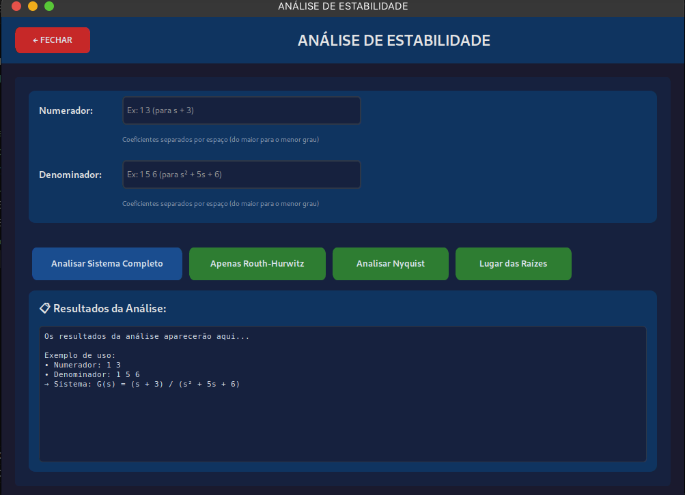
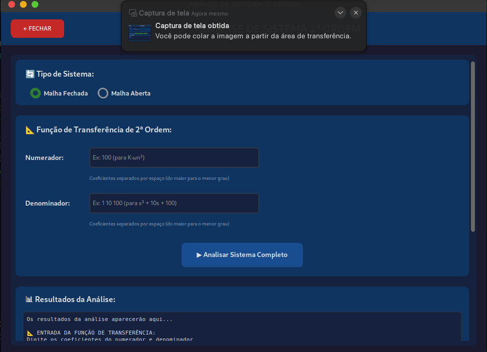

# ⚙️ Analisador de Sistemas de Controle de Segunda Ordem com PI, PD e PID ⚙️


[](https://opensource.org/licenses/MIT) **Trabalho de Conclusão de Curso - Engenharia de Computação**
*Aluno: Luís Fernando Alexandre dos Santos*
*Orientador: Prof. Dr. Cecilio Martins de Sousa Neto*
*Universidade Federal Rural do Semi-Árido - 2025*

## 📜 Descrição Geral

Esta é uma ferramenta computacional desenvolvida em Python com o objetivo de **auxiliar estudantes e profissionais** das áreas de Engenharia (Controle, Computação, Elétrica, Mecatrônica) na **análise e caracterização de sistemas de controle dinâmicos**, com foco em sistemas de segunda ordem e na aplicação de controladores clássicos PI, PD e PID.

A aplicação oferece uma interface gráfica intuitiva que permite visualizar o comportamento de sistemas lineares invariantes no tempo (SLITs), avaliar sua estabilidade e entender como diferentes estratégias de controle afetam métricas de desempenho cruciais como **sobressinal (overshoot), tempo de acomodação, tempo de subida e erro em regime permanente**.

## ✨ Screenshots Principais

Aqui estão algumas das telas principais da aplicação:

**1. Tela Principal:** Ponto de entrada onde o usuário seleciona o módulo de análise desejado.


**2. Análise de Controladores (Resposta Temporal):** Comparativo visual entre o sistema original e o sistema com controlador PI, PD ou PID aplicado.


**3. Análise de Estabilidade (Routh-Hurwitz):** Módulo para inserir a equação característica e obter a análise de estabilidade via critério de Routh-Hurwitz.


**4. Análise de Sistema de 2ª Ordem:** Ferramenta para extrair parâmetros ($\omega_n$, $\zeta$, K) e métricas de desempenho diretamente da função de transferência.


*(Adicione mais screenshots se desejar, como LGR e Polos/Zeros)*
## 🧠 Conceitos Teóricos Abordados

A ferramenta se baseia em conceitos fundamentais da Teoria de Controle Clássico:

* **Função de Transferência:** Representação matemática da dinâmica de um sistema linear no domínio de Laplace, $G(s) = \frac{N(s)}{D(s)}$.
* **Sistemas de Segunda Ordem:** Sistemas cuja dinâmica é descrita por uma equação diferencial de segunda ordem. A forma padrão em malha fechada é $G(s) = \frac{K \omega_n^2}{s^2 + 2\zeta\omega_n s + \omega_n^2}$, onde:
    * $\omega_n$: Frequência natural (velocidade da resposta).
    * $\zeta$: Coeficiente de amortecimento (forma da resposta: subamortecida, crítica, superamortecida).
    * $K$: Ganho estático (valor final para entrada degrau unitário, se estável).
* **Estabilidade:** A capacidade de um sistema retornar a um estado de equilíbrio após uma perturbação. Analisada através de:
    * **Critério de Routh-Hurwitz:** Método algébrico que verifica a existência de polos (raízes da equação característica) no semiplano direito do plano complexo, indicando instabilidade.
    * **Lugar Geométrico das Raízes (LGR):** Gráfico que mostra como a localização dos polos de malha fechada varia com o ganho do controlador, permitindo analisar a estabilidade relativa e projetar ganhos.
    * **Diagrama de Polos e Zeros:** Visualização da localização dos polos e zeros do sistema no plano complexo. Polos no semiplano direito indicam instabilidade.
    * *(Nyquist: Embora mencionado no código `criterios_estabilidade.py`, a implementação parece focar em Routh e LGR)*
* **Resposta Temporal:** Comportamento da saída do sistema ao longo do tempo em resposta a uma entrada padrão (Degrau ou Rampa). Métricas importantes incluem:
    * **Tempo de Subida (Tr):** Tempo para a resposta ir de 10% a 90% do valor final.
    * **Tempo de Pico (Tp):** Tempo para atingir o primeiro pico de sobressinal.
    * **Máximo Sobressinal (Mp%):** Percentual máximo que a resposta ultrapassa o valor final.
    * **Tempo de Acomodação (Ts):** Tempo para a resposta entrar e permanecer dentro de uma faixa (geralmente ±2% ou ±5%) do valor final.
* **Erro em Regime Permanente ($e_{ss}$):** A diferença entre a entrada desejada e a saída do sistema após um longo tempo. Depende do *tipo* do sistema (número de integradores na malha aberta) e do tipo da entrada (degrau, rampa, etc.).
* **Controladores PID:**
    * **Proporcional (P):** Atua proporcionalmente ao erro atual (afeta a velocidade e o erro $e_{ss}$).
    * **Integral (I):** Atua na integral do erro passado (elimina o erro $e_{ss}$ para entradas degrau, mas pode piorar a resposta transitória).
    * **Derivativo (D):** Atua na taxa de variação do erro (melhora a estabilidade e a resposta transitória, antecipando o erro).
    * **Combinações (PI, PD, PID):** Usadas para atender a múltiplos requisitos de desempenho.

## 🧭 Módulos da Aplicação (Botões)

A aplicação é dividida em três módulos principais, acessíveis pela tela inicial:

1.  **📊 ANÁLISE DE ESTABILIDADE:**
    * **Objetivo:** Avaliar a estabilidade de um sistema a partir de sua **equação característica** (denominador da função de transferência de malha fechada).
    * **Funcionalidade:** Implementa o **Critério de Routh-Hurwitz**, gerando a tabela de Routh e indicando o número de polos instáveis (no semiplano direito). Calcula também as raízes exatas do polinômio. *(Possui placeholders para Nyquist e LGR, mas a análise principal é Routh)*.
    * **Entrada:** Coeficientes do polinômio característico (denominador).
    * **Saída:** Relatório textual com a tabela de Routh, conclusão sobre a estabilidade e as raízes calculadas.

2.  **⚙️ ANÁLISE DE SISTEMA 2ª ORDEM:**
    * **Objetivo:** Analisar em detalhes um sistema que *já se sabe* ser de segunda ordem, extraindo seus parâmetros fundamentais e métricas de desempenho.
    * **Funcionalidade:** Recebe a função de transferência (numerador e denominador) e calcula $\omega_n$, $\zeta$ e K. Com base nesses parâmetros, classifica o sistema (subamortecido, etc.), calcula os polos, as métricas de resposta temporal (Tr, Tp, Ts), as características da resposta ao degrau (Mp, $e_{ss}$) e fornece uma análise de estabilidade com recomendações.
    * **Entrada:** Coeficientes do numerador e denominador (assumindo denominador de grau 2) e tipo de malha (aberta/fechada para interpretação do ganho).
    * **Saída:** Relatório textual completo com todos os parâmetros, cálculos, classificações e recomendações.

3.  **📈 ANÁLISE DE CONTROLADORES:**
    * **Objetivo:** Comparar o comportamento de um sistema original (planta) com o comportamento do mesmo sistema após a adição de um controlador PI, PD ou PID em malha fechada.
    * **Funcionalidade:** Permite ao usuário definir a planta $G(s)$, escolher o tipo de entrada (Degrau/Rampa), selecionar o controlador ($Gc(s)$ - PI, PD ou PID) e seus ganhos (Kp, Ki, Kd). A aplicação então gera e exibe lado a lado:
        * **Resposta Temporal:** Gráfico da saída $y(t)$ do sistema original (malha aberta $G(s)$) e do sistema controlado (malha fechada $\frac{Gc(s)G(s)}{1+Gc(s)G(s)}$). Inclui cálculo e exibição das métricas ($\omega_n, \zeta$, Tr, Ts, Mp, Tp) para ambos os casos.
        * **Lugar das Raízes:** Gráfico do LGR para a malha aberta original $G(s)$ e para a malha aberta com controlador $Gc(s)G(s)$.
        * **Polos e Zeros:** Diagrama de polos e zeros do sistema em *malha fechada* com o controlador $\frac{Gc(s)G(s)}{1+Gc(s)G(s)}$, com análise textual de estabilidade.
    * **Entrada:** Coeficientes da planta $G(s)$, tipo de entrada, tipo de controlador, ganhos Kp, Ki, Kd.
    * **Saída:** Gráficos interativos (com zoom/pan) e análise textual na aba Polos/Zeros.

## 🛠️ Tecnologias Utilizadas

* **Python 3.10+**
* **CustomTkinter:** Para a interface gráfica moderna e responsiva.
* **Matplotlib:** Para a geração e exibição dos gráficos incorporados na interface.
* **Control:** Biblioteca Python essencial para análise e projeto de sistemas de controle (criação de TF, `step_response`, `feedback`, `rlocus`, `poles`, `zeros`, `damp`).
* **NumPy:** Para cálculos numéricos eficientes e manipulação de arrays (vetores de tempo, coeficientes).
* **SciPy:** Utilizada especificamente para a simulação da resposta à rampa (`scipy.signal.lsim`).
* **(Opcional) CTkMessagebox:** Para exibir mensagens de sucesso/erro de forma visualmente integrada (se instalada).

## 🚀 Como Executar

1.  **Clone o repositório:**
    ```bash
    git clone [https://github.com/luisFernandoJv/sistema-de-controle---an-lise-de-sistema-de-segunda-ordem-.git](https://github.com/luisFernandoJv/sistema-de-controle---an-lise-de-sistema-de-segunda-ordem-.git)
    cd sistema-de-controle---an-lise-de-sistema-de-segunda-ordem-
    ```

2.  **Crie e ative um ambiente virtual (recomendado):**
    ```bash
    python -m venv venv
    source venv/bin/activate  # Linux/macOS
    # ou
    .\venv\Scripts\activate  # Windows
    ```

3.  **Instale as dependências:**
    *(Certifique-se de ter um arquivo `requirements.txt` na raiz do projeto)*
    ```bash
    pip install -r requirements.txt
    ```
    *Exemplo de `requirements.txt`:*
    ```
    customtkinter
    matplotlib
    control
    numpy
    scipy
    Pillow # Necessário pelo tela.py para carregar imagens
    CTkMessagebox # Opcional
    ```

4.  **Execute a aplicação principal (`tela.py`):**
    ```bash
    python tela.py
    ```

## 📄 Licença

Este projeto é distribuído sob a licença MIT. Veja o arquivo `LICENSE` para mais detalhes. (Se você não tiver um, pode remover esta linha ou adicionar um arquivo LICENSE com o texto da licença MIT).

---