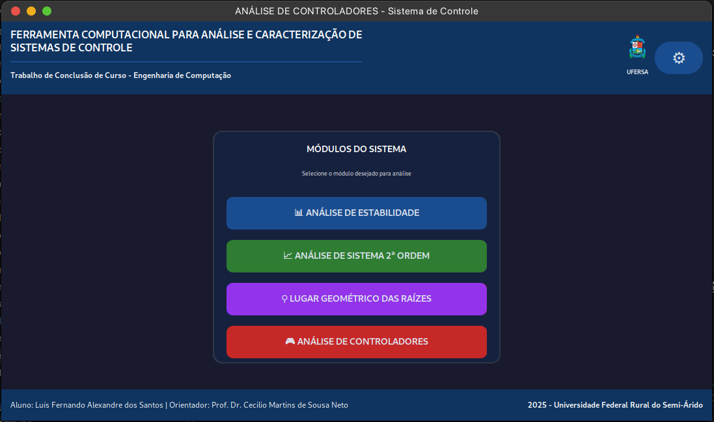
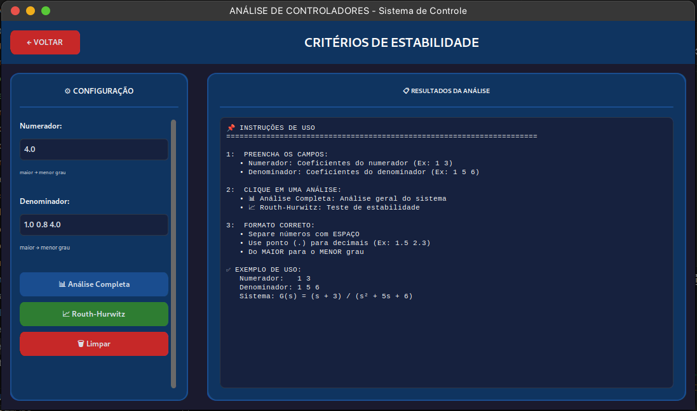
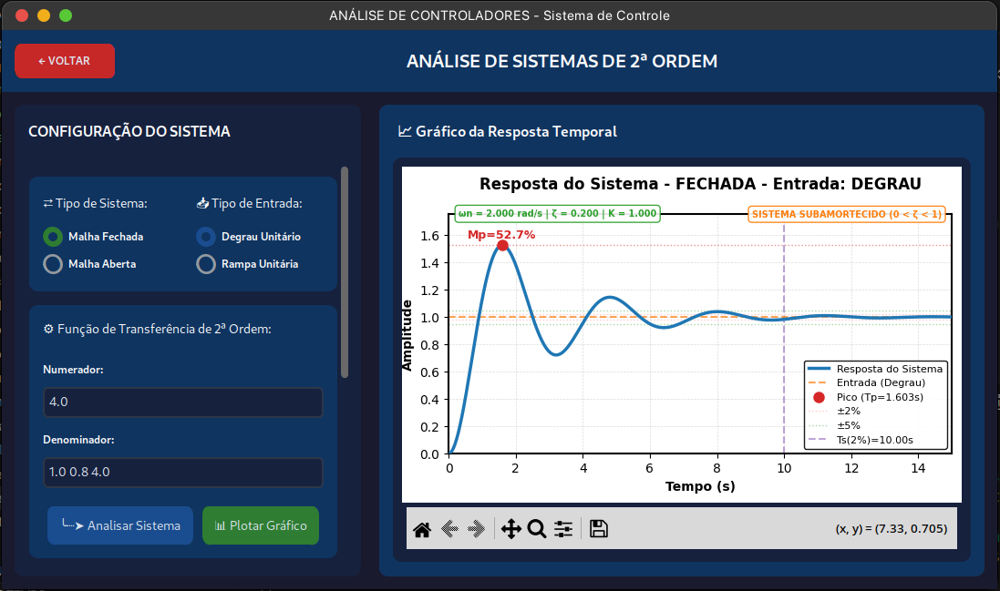
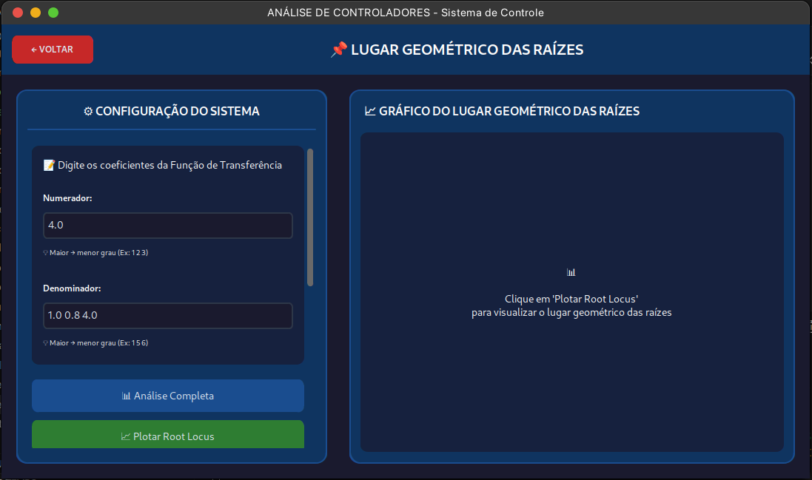
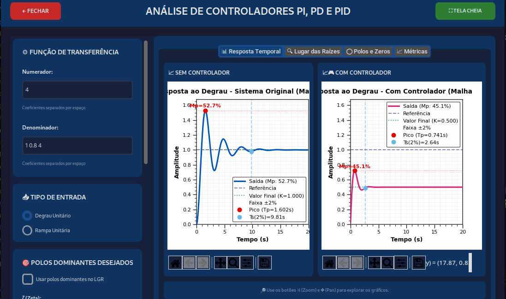

# ⚙️ Ferramenta Computacional para Análise de Sistemas de Controle ⚙️


[](https://opensource.org/licenses/MIT)

**Trabalho de Conclusão de Curso - Engenharia de Computação**
*Aluno: Luís Fernando Alexandre dos Santos*
*Orientador: Prof. Dr. Cecilio Martins de Sousa Neto*
*Universidade Federal Rural do Semi-Árido - 2025*

## 📜 Descrição Geral

Esta é uma ferramenta computacional desenvolvida em Python com o objetivo de **auxiliar estudantes e profissionais** das áreas de Engenharia (Controle, Computação, Elétrica, Mecatrônica) na **análise, projeto e caracterização de sistemas de controle dinâmicos**.

A aplicação oferece uma interface gráfica intuitiva que permite:
* Analisar a estabilidade de sistemas lineares pelo critério de **Routh-Hurwitz**.
* Extrair parâmetros de desempenho ($\omega_n$, $\zeta$) de **sistemas de segunda ordem**.
* Realizar uma análise textual e gráfica completa do **Lugar Geométrico das Raízes (LGR)**.
* Projetar e simular controladores clássicos **PI, PD e PID**, comparando a resposta temporal, o LGR e o mapa de polos/zeros do sistema original versus o sistema controlado.

## ✨ Módulos Principais

A ferramenta é dividida em quatro módulos independentes, cada um focado em uma etapa diferente da análise de sistemas de controle.

| Módulo | Screenshot |
| :--- | :--- |
| **1. Tela Principal** |  |
| **2. Análise de Estabilidade** |  |
| **3. Análise de Sistema 2ª Ordem** |  |
| **4. Lugar Geométrico das Raízes** | ** |
| **5. Análise de Controladores** |  |

---

## 🧭 Funcionalidades dos Módulos

A aplicação é dividida em quatro módulos principais, acessíveis pela tela inicial:

### 1. 📊 Análise de Estabilidade
* **Objetivo:** Avaliar a estabilidade de um sistema a partir de sua **equação característica**.
* **Funcionalidade:** Implementa o **Critério de Routh-Hurwitz**, gerando a tabela de Routh formatada e indicando o número de polos instáveis.
* **Entrada:** Coeficientes do polinômio característico (denominador).
* **Saída:** Relatório textual completo, incluindo a tabela de Routh, as raízes do polinômio (polos) e uma conclusão clara sobre a estabilidade do sistema.

### 2. ⚙️ Análise de Sistema 2ª Ordem
* **Objetivo:** Extrair parâmetros fundamentais e métricas de desempenho de um sistema de segunda ordem.
* **Funcionalidade:** Recebe a função de transferência (numerador e denominador) e calcula os parâmetros $\omega_n$ (frequência natural), $\zeta$ (coeficiente de amortecimento) e K (ganho).
* **Saída:** Relatório textual detalhado com todos os parâmetros, classificação do sistema (subamortecido, etc.) e as métricas de resposta temporal (Tr, Tp, Ts, Mp).

### 3. 📌 Lugar Geométrico das Raízes (LGR)
* **Objetivo:** Fornecer uma análise completa, textual e gráfica, do LGR de um sistema em malha aberta.
* **Funcionalidade:** Este módulo dedicado calcula todas as 6 regras de construção do LGR.
* **Saída:**
    * **Gráfico Interativo:** Plota os polos, zeros, ramos, segmentos do eixo real e assíntotas.
    * **Relatório Detalhado:** Gera um relatório de texto completo, formatado de maneira didática, contendo:
        1.  Polos e Zeros.
        2.  Segmentos do eixo real que pertencem ao LGR.
        3.  Cálculo das Assíntotas (centro e ângulos).
        4.  Pontos de Entrada/Saída (cálculo de dK/ds = 0).
        5.  Ângulos de Partida e Chegada (para polos/zeros complexos).
        6.  Análise de **Routh-Hurwitz** para encontrar o **Ganho Crítico (K)** e os pontos de **cruzamento com o eixo jω**.

### 4. 🎮 Análise de Controladores (PI, PD, PID)
* **Objetivo:** Projetar, simular e comparar o desempenho de um sistema com e sem um controlador.
* **Funcionalidade:** Permite ao usuário definir a planta G(s), o tipo de entrada (Degrau/Rampa) e os ganhos (Kp, Ki, Kd) do controlador.
* **Saída:** Uma interface multi-abas com comparativos lado a lado:
    * **Resposta Temporal:** Gráfico da saída $y(t)$ do sistema original vs. sistema controlado.
    * **Lugar das Raízes:** Gráfico do LGR de $G(s)$ vs. $G_c(s)G(s)$.
    * **Polos e Zeros:** Mapa de polos/zeros do sistema *final* (malha fechada).
    * **Métricas:** Tabela comparativa de desempenho (Tr, Ts, Mp, etc.).
* **Nova Funcionalidade:** A aba LGR deste módulo permite ao usuário especificar **polos dominantes desejados** (inserindo $\zeta$ e $\omega_n$) e exibe no gráfico a linha de $\zeta$ constante e os polos desejados, auxiliando no projeto do controlador.

---

## 🧠 Conceitos Teóricos Abordados

A ferramenta se baseia em conceitos fundamentais da Teoria de Controle Clássico:

* **Função de Transferência:** Representação matemática da dinâmica de um sistema linear no domínio de Laplace, $G(s) = \frac{N(s)}{D(s)}$.
* **Sistemas de Segunda Ordem:** Sistemas cuja dinâmica é descrita por uma equação diferencial de segunda ordem. A forma padrão em malha fechada é $G(s) = \frac{K \omega_n^2}{s^2 + 2\zeta\omega_n s + \omega_n^2}$, onde:
    * $\omega_n$: Frequência natural (velocidade da resposta).
    * $\zeta$: Coeficiente de amortecimento (forma da resposta: subamortecida, crítica, superamortecida).
* **Estabilidade (Critério de Routh-Hurwitz):** Método algébrico que, a partir da equação característica, determina o número de polos no semiplano direito (indicando instabilidade).
* **Lugar Geométrico das Raízes (LGR):** Gráfico que mostra como os polos de malha fechada se movem no plano-s à medida que um ganho (K) varia de 0 a $\infty$.
* **Resposta Temporal:** Comportamento da saída do sistema ao longo do tempo em resposta a uma entrada (Degrau ou Rampa). Métricas importantes incluem:
    * **Tempo de Subida (Tr):** Tempo para a resposta ir de 10% a 90% do valor final.
    * **Tempo de Pico (Tp):** Tempo para atingir o primeiro pico de sobressinal.
    * **Máximo Sobressinal (Mp%):** Percentual máximo que a resposta ultrapassa o valor final.
    * **Tempo de Acomodação (Ts):** Tempo para a resposta entrar e permanecer dentro de uma faixa (geralmente ±2%) do valor final.
* **Erro em Regime Permanente ($e_{ss}$):** A diferença entre a entrada desejada e a saída do sistema após um longo tempo.
* **Controladores PID:**
    * **Proporcional (P):** Atua proporcionalmente ao erro atual.
    * **Integral (I):** Atua na integral do erro passado (elimina o $e_{ss}$ para entradas degrau).
    * **Derivativo (D):** Atua na taxa de variação do erro (melhora a estabilidade e a resposta transitória).

---

## 🛠️ Tecnologias Utilizadas

* **Python 3.10+**
* **CustomTkinter:** Para a interface gráfica moderna e responsiva.
* **Matplotlib:** Para a geração e exibição dos gráficos incorporados na interface.
* **Control:** Biblioteca Python essencial para análise e projeto de sistemas de controle (criação de TF, `step_response`, `feedback`, `rlocus`, `poles`, `zeros`, `damp`).
* **NumPy:** Para cálculos numéricos eficientes e manipulação de arrays.
* **SciPy:** Utilizada para a simulação da resposta à rampa (`scipy.signal.lsim`).
* **SymPy:** Utilizada para os cálculos simbólicos do LGR, como `dK/ds = 0`, e para a construção da tabela de Routh-Hurwitz com o ganho `k`.
* **Pillow (PIL):** Necessário pelo `tela.py` para carregar e exibir imagens na interface.

## 🚀 Como Executar

1.  **Clone o repositório:**
    ```bash
    git clone [https://github.com/luisFernandoJv/sistema-de-controle---an-lise-de-sistema-de-segunda-ordem-.git](https://github.com/luisFernandoJv/sistema-de-controle---an-lise-de-sistema-de-segunda-ordem-.git)
    cd sistema-de-controle---an-lise-de-sistema-de-segunda-ordem-
    ```

2.  **Crie e ative um ambiente virtual (recomendado):**
    ```bash
    python -m venv venv
    source venv/bin/activate  # Linux/macOS
    # ou
    .\venv\Scripts\activate  # Windows
    ```

3.  **Instale as dependências:**
    *(Certifique-se de ter um arquivo `requirements.txt`)*
    ```bash
    pip install -r requirements.txt
    ```
    *Seu `requirements.txt` deve conter:*
    ```
    customtkinter
    matplotlib
    control
    numpy
    scipy
    sympy
    Pillow
    ```

4.  **Execute a aplicação principal (`tela.py`):**
    ```bash
    python tela.py
    ```

## 📄 Licença

Este projeto é distribuído sob a licença MIT.